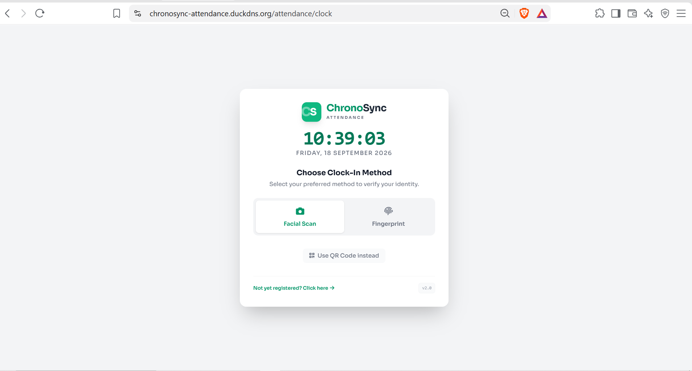
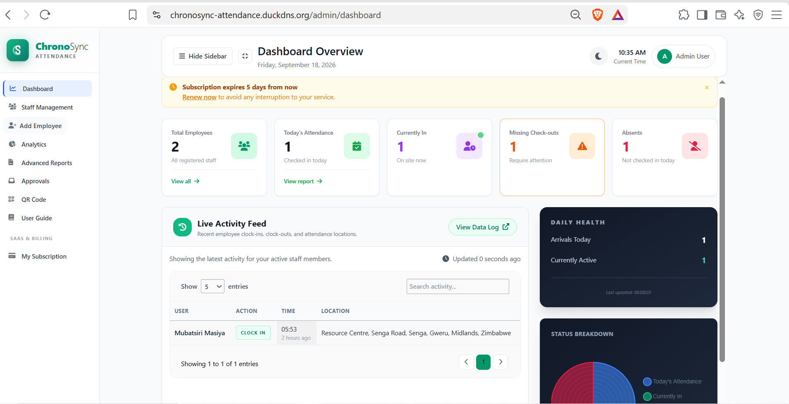
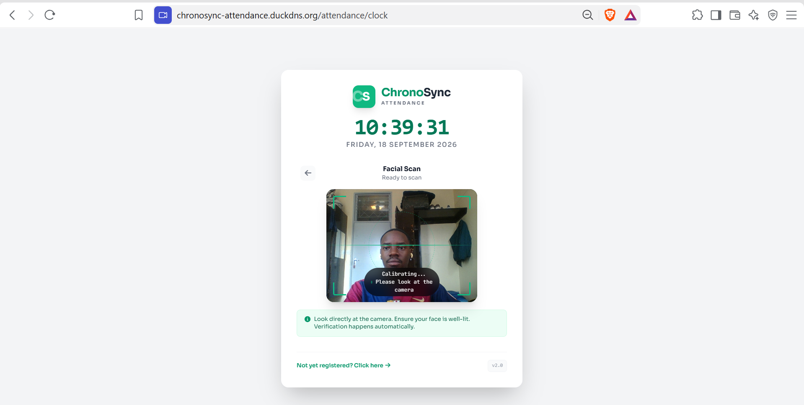
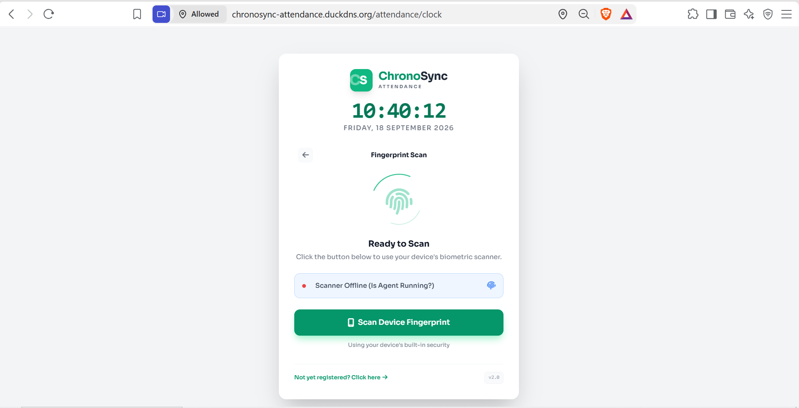
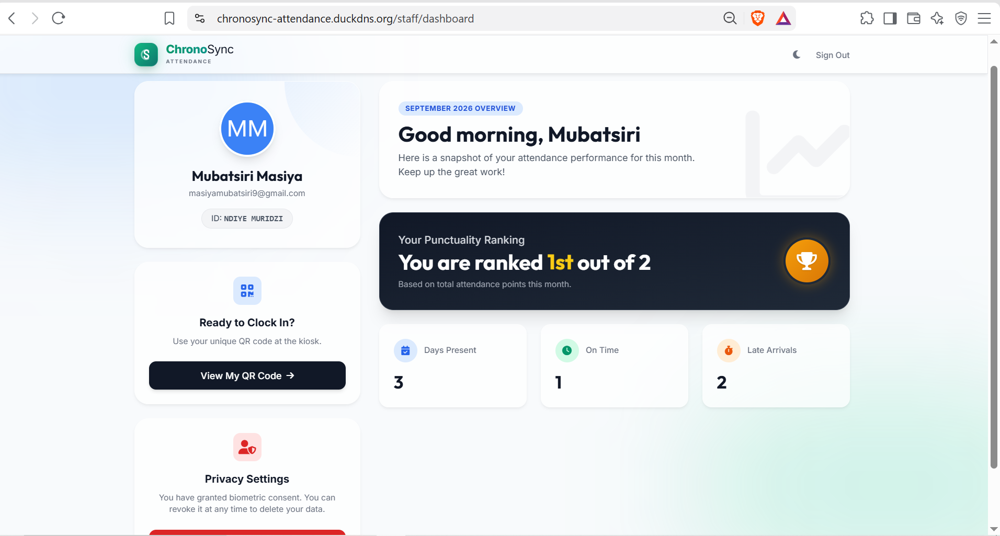
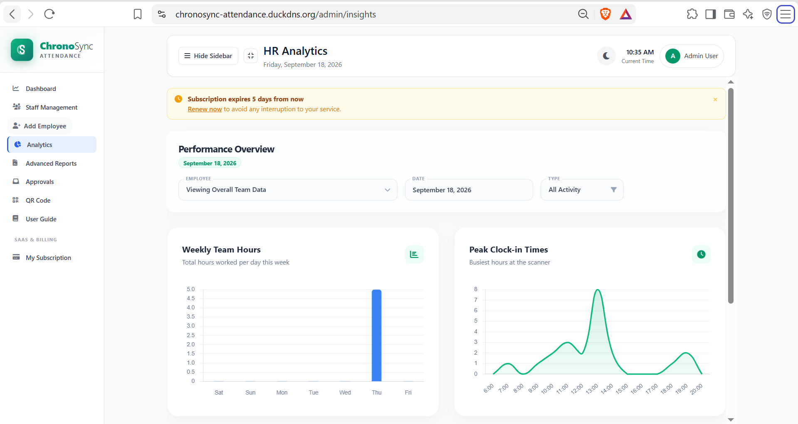

<div align="center">
  <h1>ChronoSync Attendance</h1>
  <p><strong>A modern attendance tracking system featuring facial recognition and passwordless authentication.</strong></p>
</div>

## Overview

ChronoSync is a full-stack attendance management system designed for speed, security, and ease of use. It replaces traditional attendance methods with a touchless experience using computer vision and modern web standards.

## System Previews

| Landing Page | Admin Dashboard |
|:---:|:---:|
|  |  |

| Facial Scan | Fingerprint / WebAuthn |
|:---:|:---:|
|  |  |

| Staff Dashboard | Analytics & Reports |
|:---:|:---:|
|  |  |

## Key Features

- **AI Facial Recognition**: High-performance Python microservice using OpenCV and `face_recognition` to instantly identify and log users via webcam.
- **Passwordless Authentication**: Implements WebAuthn for secure, hardware-backed passkey authentication, alongside Google OAuth for quick onboarding.
- **Dockerized Architecture**: The entire stack is containerized for portability, utilizing separate containers for the web application, job queues, PostgreSQL database, and the Python ML server.
- **Zero-Downtime Deployments**: Engineered for continuous integration with a deployment pipeline that hot-swaps containers without bringing the system offline.
- **Real-time Reporting**: Administrative dashboards built with Laravel Blade and raw CSS/Tailwind to track attendance metrics and employee data in real-time.
- **Secure by Default**: Served securely over HTTPS using Caddy as a reverse proxy with automated SSL configuration.

## Technology Stack

- **Backend**: Laravel (PHP), PostgreSQL
- **Machine Learning**: Python, OpenCV, `face_recognition`
- **Frontend**: Blade Templates, Tailwind CSS, JavaScript
- **Infrastructure**: Docker, Docker Compose, Caddy Server

## Documentation

Detailed documentation and operational guides are available in the [`docs/`](/docs) directory:

- [Linux Deployment Guide](/docs/LINUX_DEPLOYMENT_GUIDE.md) - Full instructions for provisioning and deploying to a cloud server (e.g., Oracle Cloud).
- [General Deployment](/docs/DEPLOYMENT.md) - Instructions for configuring SSL and the persistent Python recognition server.

## Local Development

To run this project locally, ensure you have Docker installed and run:

```bash
docker compose up -d
```
*Note: The facial recognition server requires a webcam and must be accessed over HTTPS or localhost.*
